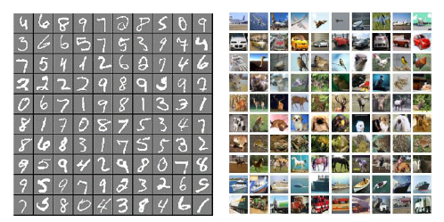

# LiSHT
This repository contains a Keras implementation of the paper "LiSHT: Non-Parametric Linearly Scaled Hyperbolic Tangent Activation Function for Neural Networks" - https://arxiv.org/abs/1901.05894

            Roy, S. K., Manna, S., Dubey, S. R., and Chaudhuri, B. B., 2019. LiSHT: Non-Parametric Linearly 
            Scaled HyperbolicTangent Activation Function for Neural Networks. arXiv preprint arXiv:1901.05894.
            
            
## Description
The  activation function in neural network is one of the important aspects which facilitates the deep training by introducing the non-linearity into the learning process. However, because of zero-hard rectification, some the of existing activations function  such as ReLU and Swish miss to utilize the negative input values and may suffer from the dying gradient problem. Thus, it is important to look for a better activation function which is free from such problems. As a remedy, this paper proposes a new non-parametric function, called Linearly Scaled Hyperbolic Tangent (LiSHT) for Neural Networks (NNs). The proposed LiSHT activation  function is an attempt to scale the non-linear Hyperbolic Tangent (Tanh) function by a linear function and tackle the dying gradient problem.

## Pre-Activation ResNet

## Experimental Data
 
 The effectiveness of the proposed LiSHT activation function is evaluated on six benchmark datasets:
 
 - [Car Evaluation Dataset](https://archive.ics.uci.edu/ml/datasets/car+evaluation)
 - [Iris Flower Dataset](https://archive.ics.uci.edu/ml/datasets/iris)
 - [MNIST Dataset](http://yann.lecun.com/exdb/mnist/)
 - [CIFAR-10 Dataset](https://www.cs.toronto.edu/~kriz/cifar.html)
 - [CIFAR-100 Dataset](https://www.cs.toronto.edu/~kriz/cifar.html)
 - [Twitter140 Dataset](https://www.kaggle.com/kazanova/sentiment140)
 
 

## Results
